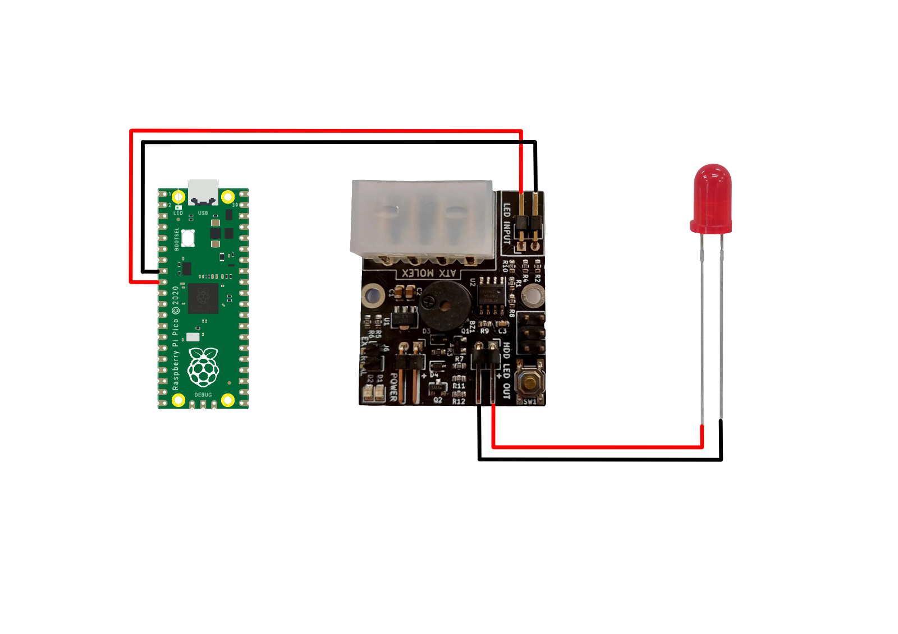

This Python script, aptly named `file_access_monitor.py`, is a tool designed for monitoring file access events and providing GPIO control, with a particular focus on the use with the HDDClicker to get hard drive sounds from the activity of an emulators hard drive image. It can also be used to make a led light up based on the activity of a hard drive image that an emulator like pcem og fs-uae use. It is only tested in Linux, and I doubt it works on other OSes due to the way I use pyinotify. 

Developed to use the Raspberry Pi Pico for GPIO on computers which don't have gpio. The Pico needs to be flashed with the picod daemon : http://abyz.me.uk/picod/download.html

**Features:**

-   **Inotify-based File Monitoring:** Leveraging the power of the `pyinotify` module, the script keeps an eye on a specified file path for access events.
    
-   **GPIO Control:** Integrated with the `picod` module, the script triggers GPIO signals, allowing integration with hardware components such as the HDDClicker or LEDs. This feature can enables visual and/or audio feedback when the monitored file is accessed.
    
-   **Versatile Application:** While the script serves as a general-purpose file access monitor with GPIO control, it has been tailored for use with HDDClicker, making it an ideal companion for projects involving emulators.
    

**Usage:**

1.  **Hardware Requirements:** Raspberry Pi Pico.
    
2.  **Dependencies:** Install the necessary Python modules using `pip install -r requirements.txt`.
    
3.  **File Specification:** Set the file path to be monitored by modifying the `file_path` variable in the script.

4.  **Connect the hddclicker:** Connect the hddclicker to GPIO pin 6 on the Raspberry Pi Pico (and optional LED to the hddclicker or directly to GPIO pin 6 if you don't plan to use the hddclicker.    
    
5.  **Run the Script:** Execute the script to commence monitoring. Use GPIO signals for LED and HDDClicker control and optional printed outputs (1 for access, 0 for no access) based on file interaction.
    

**Example:**

    `python file_access_monitor.py` 

Or if you want it to start at bootup simply add it to crontab (or make a systemd startupscript)

    crontab -e

    @reboot /full/path/to/python /full/path/to/file_access_monitor.py

**How to connect the HDDClicker and LED**

